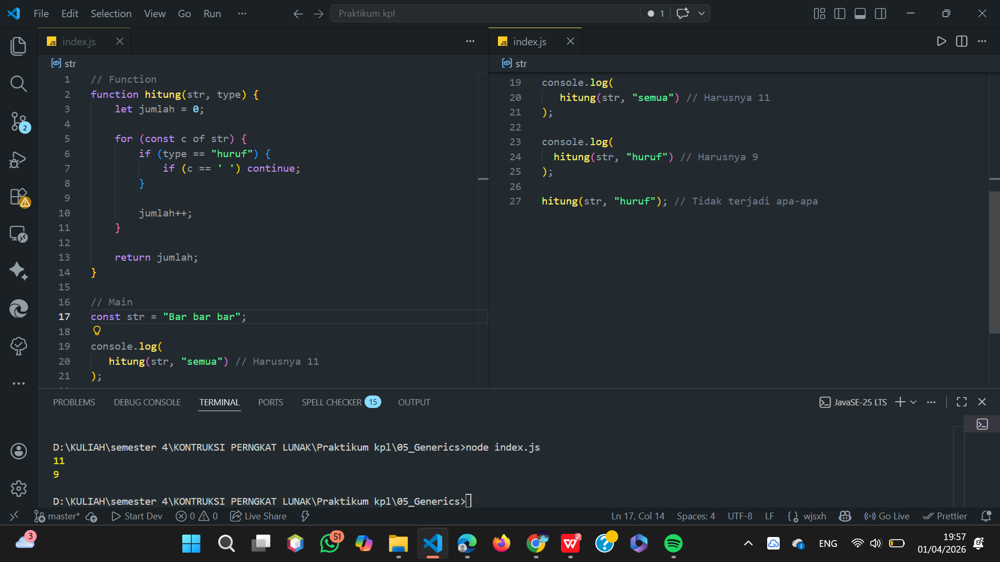

ugas Pendahuluan 05: Generics
Nama : Aditio Nugroho
NIM : 103122400008
Kelas: SE0801

Tugas
Bagaimana caramu hanya dengan satu fungsi generik bisa mengurus keduanya?

Program/Kode
tersedia di Program/Kode
[index.js](https://github.com/aditionugroho/KPL_AditioNugroho_103122400008_SE-08-01/blob/main/05_Generics/index.js)

Output

Deskripsi
Program ini menampilkan fungsi hitung yang memiliki 2 parameter yaitu str(karakter yang dihitung)dan type(tipe). Lalu dilakukan perulangan dari str, jika type == "huruf", maka spasi tidak akan dihitung dan otomatis dilanjutkan. jumlah karakter disimpan pada variabel jumlah dan dikembalikan(return). Lalu ditampilkan di main atau console.log sesuai parameter. sehingga parameter "semua" jumlahnya 11. Sedangkan parameter "huruf" hasilnya 9.