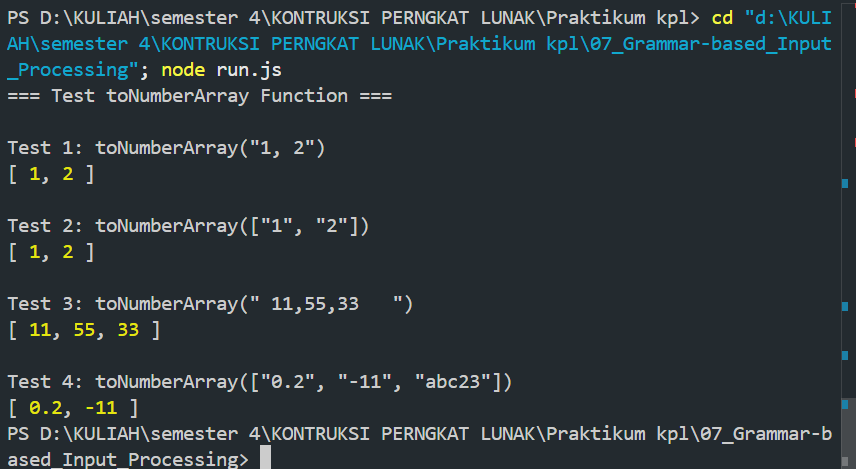

Tugas Pendahuluan 07: Grammar-based Input Processing
Nama : Aditio Nugroho
NIM : 103122400008
Kelas: SE0801

Tugas
Buatlah fungsi yang mengubah deretan angka bertipe string menjadi larik angka.

Program/Kode
tersedia di [index.html](https://github.com/aditionugroho/KPL_AditioNugroho_103122400008_SE-08-01/blob/main/07_Grammar-based_Input_Processing/index.html)

Output

Deskripsi
Program menjalankan sebuah function toNumberArray untuk mengubah data string atau array string menjadi larik angka. Jika variabel number adalah string maka akan diubah menjadi array dengan split. Jika variabel number sudah berupa array, maka akan langsung digunakan. Jika bukan keduanya maka akan menghasilkan input TypeError. Lalu setiap fungsi akan memproseskan tiap elemen array dengan map() dan membersihkan spasi dengan trim(). Lalu mengonversi menjadi angka menggunakan parseFloat(). Terakhir menggunakan filter untuk menghapus nilai yang bukan angka.(NaN).