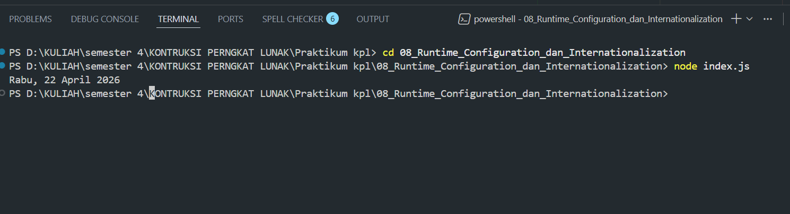

Tugas Pendahuluan 08: Runtime Configuration dan Internationalization
Nama : Aditio Nugroho
NIM : 103122400008
Kelas: SE0801

Tugas
Tampilkan tanggal sekarang dengan format seperti ini:

Sabtu, 18 April 2026

Nilai waktu tidak harus sama, asalkan formatnya benar dan bisa tampil di komputer terpisah pada waktu tertentu. Gunakan Intl.DateTimeFormat (bukan string manual).

Program/Kode
tersedia di [index.js](https://github.com/aditionugroho/KPL_AditioNugroho_103122400008_SE-08-01/blob/main/08_Runtime_Configuration_dan_Internationalization/index.js)

Output

Deskripsi
Program mengambil waktu saat ini menggunakan Intl.DateTimeFormat untuk menampilkan hari, tanggal, bulan, dan tahun sesuai pada negara Indonesia. Pada bagian variabel weekday dan month menggunakan 'long' untuk output berupa teks. Sedangkan bagian variabel day dan year menggunakan 'numeric' untuk output berupa angka.